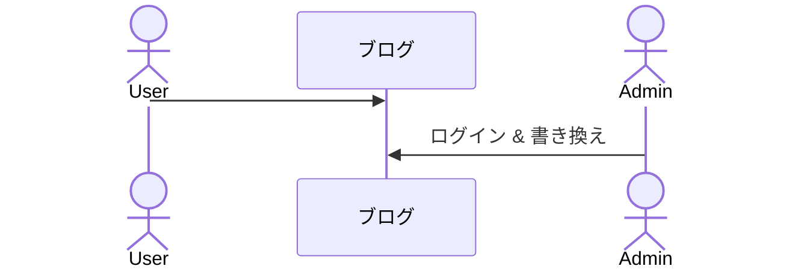

# 仕様
webサイト(ブログ)

# 要件定義
* 管理者ユーザー
    * ログイン, ログアウト
    * ブログのCRUD
* アノニマスユーザー
    * ブログの閲覧

  

```mermaid
sequenceDiagram
  actor User
  User ->> ブログ: 
  actor Admin
  Admin ->> ブログ:　ログイン & 書き換え
```

# 環境
Python_______
django_______
